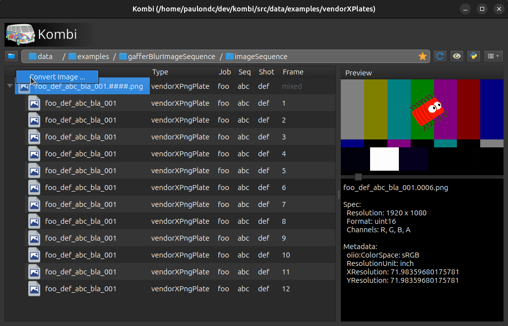

# Kombi
[](https://travis-ci.org/kombiHQ/kombi)

<p align="center">
    
</p>

Kombi is a library & application focused in processing data across different applications and libraries.

This is done by providing an API that simplifies the process of grabbing whether a partial or full data generated as output of a task (application/library) and use them subsequently as input of sub tasks, and so on.

Such as during the ingestion of files, versioning data, creating different variations for the same data, (etc). Where these processes may look simple at first glance they grow in complexity overtime, making them hard to maintain specially when different applications/libraries are involved.

In order to avoid writing boilerplate code, Kombi provides high-level declarative definitions that can be expressed through:

<details open="1"><summary>YAML</summary>
<p>


```yaml
---
vars:
  prefix: "/tmp"
tasks:
- run: gafferScene
  metadata:
    match.types:
    - png
    match.vars:
      imageType:
      - sequence
  options:
    scene: "{configDirectory}/scene.gfr"
  target: "{prefix}/gafferBlurImageSequence/(newver <parent> as <ver>)/{name}_<ver>.(pad {frame} 6).exr"
  tasks:
  - run: ffmpeg
    options:
      frameRate: 23.976
      sourceColorSpace: bt709
      targetColorSpace: smpte170m
    target: "(dirname {filePath})/{name}.mov"
```
</p>
</details>

<details><summary>TOML</summary>
<p>

```toml
[vars]
prefix = "/tmp"

[[tasks]]
run = "gafferScene"
target = "{prefix}/gafferBlurImageSequence/(newver <parent> as <ver>)/{name}_<ver>.(pad {frame} 6).exr"

  [tasks.metadata]
  "match.types" = [
    "png"
  ]

    [tasks.metadata."match.vars"]
    imageType = [
      "sequence"
    ]

  [tasks.options]
  scene = "{configDirectory}/scene.gfr"

  [[tasks.tasks]]
  run = "ffmpeg"
  target = "(dirname {filePath})/{name}.mov"

    [tasks.tasks.options]
    frameRate = 23.976
    sourceColorSpace = "bt709"
    targetColorSpace = "smpte170m"
```
</details>

<details><summary>JSON</summary>
<p>

```json
{
  "vars": {
    "prefix": "/tmp"
  },
  "tasks": [
    {
      "run": "gafferScene",
      "metadata": {
        "match.types": [
          "png"
        ],
        "match.vars": {
          "imageType": [
            "sequence"
          ]
        }
      },
      "options": {
        "scene": "{configDirectory}/scene.gfr"
      },
      "target": "{prefix}/gafferBlurImageSequence/(newver <parent> as <ver>)/{name}_<ver>.(pad {frame} 6).exr",
      "tasks": [
        {
          "run": "ffmpeg",
          "options":{
            "frameRate": 23.976,
            "sourceColorSpace": "bt709",
            "targetColorSpace": "smpte170m"
          },
          "target": "(dirname {filePath})/{name}.mov"
        }
      ]
    }
  ]
}
```
</details>

Additionally you can run Kombi from

<details><summary>Python</summary>
<p>

```python
# TODO
```
</details>

<details><summary>Gaffer (node-based)</summary>
<p>

```
coming soon
```
</details>

### Supported platforms
- Linux
- windows

### Dependencies

Name | Version | Required
--- | --- | ---
CMake | 2.8+ | YES
Python | 3.5+/2.7+ | YES
Open Image OI | 1.7+ | YES
Open color IO | 1.0+ | NO
Gaffer | 0.53+ | NO
FFmpeg | 3.0+ | NO
Qt | 5.0+ |  NO
PySide | 2.0+ | NO
nuke | 9.0+ | NO
maya | 2016+ | NO

## Installing

Make sure you have the required dependencies used by this project on your system (In case you are building the dependencies manually skip the step below):

### Installing dependencies

<details><summary>Linux</summary>
<p>

#### Ubuntu and derivatives:
```bash
pip install PySide2
apt-get install make cmake
apt-get install python-openimageio openimageio-tools
apt-get install python-pyopencolorio 
apt-get install ffmpeg
```

#### CentOS/Fedora (requires EPEL):
```bash
pip install PySide2
yum install make cmake
yum install python-OpenImageIO OpenImageIO-utils
yum install ffmpeg
```
</details>

<details><summary>windows</summary>
<p>

> For windows users please make sure you have `make` available. It can be done through Cygwin (you are going to need the posix tools for development in Kombi).

- [Cygwin](https://www.cygwin.com)
- [Python 3.6](https://www.python.org/downloads)
- [FFmpeg](https://ffmpeg.org)
- [PySide2](https://pypi.org/project/PySide2)
- [Open Image IO](https://www.lfd.uci.edu/~gohlke/pythonlibs/#openimageio) (Unofficial windows binary)

</details>

### Building Kombi

```bash
cd <SRC_LOCATION>
mkdir build
cd build
cmake -DCMAKE_INSTALL_PREFIX=<TARGET_LOCATION> -G "Unix Makefiles" ..
make all install
```

## Running 
The launchers are provided inside of the "bin" directory found inside of the installation.

Kombi command-line:
```bash
kombi --help
```

Kombi file picker tool (requires Qt and PySide):
```bash
kombi-gui
```


## Licensing
Kombi is free software; you can redistribute it and/or modify it under the terms of the MIT License
